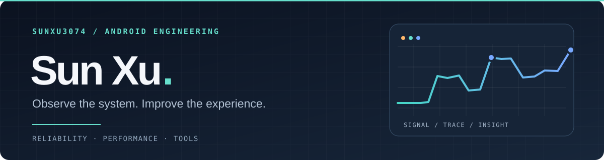

  

  I build Android software and the tools that make it easier to understand.

  关注性能、稳定性和真实设备上的疑难问题。 
  喜欢沿着日志、trace 与代码路径找到可复现、可验证的答案。

  <a href="https://blog.zhua.fun">Writing / 文章</a>
  &nbsp;&nbsp;·&nbsp;&nbsp;
  <a href="mailto:sunxu3074@gmail.com">Email / 联系</a>

